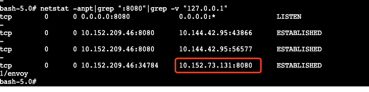

问题
----
  5月初有台迁移一台兆维机房的`xds-manager`（`10.152.73.131`）,之后有部分服务上线时，造成这个业务的下游出现`503`。
  
排障
----

  我们排查了`xds-manager`的线上日志，发现部分pod的上游IP没有更新成功，并且`xds-manager`日志缺失了部分pod的日志。
  
  第二次发生时，将线上的所有连接IP dump下来，然后将其与所有接入mesh的pod ip做比对，将缺少的pod筛出来，进入pod内部执行`netstat`查看当前的`xds-manager`连接情况是发现：
  
  
  
**这个pod依旧连接的是已经下线的IP**。

之后查其他的问题pod都是这类情况，所以断定之前的事故原因就是因为这类pod还维持一个有问题的连接导致。

《TCP/IP协议详解》中有如下说明:

>许多TCP/IP的初学者会很惊奇地发现可以没有任何数据流通过一个空闲的TCP连接。也就是说，如果TCP连接的双方都没有向对方发送数据，则在两个TCP模块之间不交换任何信息。例如，没有可以在其他网络协议中发现的轮询。这意味着我们可以启动一个客户与服务器建立一个连接，然后离去数小时、数天、数个星期或者数月，而连接依然保持。中间路由器可以崩溃和重启，电话线可以被挂断再连通，但是只要两端的主机没有被重启，则连接依然保持建立。

>这意味着两个应用进程—客户进程或服务器进程—都没有使用应用级的定时器来检测非活动状态，而这种非活动状态可以导致应用进程中的任何一个终止其活动。回想在第10.7节末尾曾提到过的BGP每隔30秒就向对端发送一个应用的探查，就是独立于TCP的保活定时器之外的应用定时器。

 原因推测是下线时直接关掉机器导致应用没有机会发出`FIN`包导致。因为在查找问题原因过程中，将一台线上服务正常重启时，这台服务重启前所有活跃连接都"转移"到另外一台`xds-manager`,在这个过程中连接并没有丢失。
 
解决方案
-------
  如果期间pod与`xds-manager`之间有数据传送，那么这个问题就避免。为了防止这类问题再次发生，`xds-manager`增加一个`/admin/healthy`接口，同时，`envoy`启动配置中增加如下设置:

``` yaml
static_resources:
  clusters:
    - name: xds_manager
      connect_timeout: 3s
      type: STATIC
      lb_policy: ROUND_ROBIN
      http2_protocol_options: {}
      health_checks:
          - timeout: 3s
            interval: 3s
            unhealthy_threshold: 3
            healthy_threshold: 1
            http_health_check:
                host: xds_manager
                path: /admin/healthy
                request_headers_to_add:
                    - header:
                        key: app_id
                        value: {{AppId}}
                expected_statuses:
                    - start: 200
                      end: 400
```